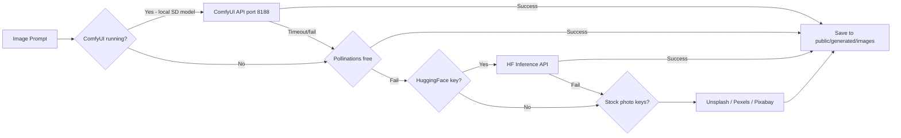

# Plan: ComfyUI Integration + Script Quality Upgrade

## Part 1 — ComfyUI Image Generation

### Current Problem
- Only source is Pollinations.ai (flaky, ~40% failure rate on thumbnails)
- HuggingFace needs a paid key for reliable inference
- No local high-quality model support
- Image prompts are good but the generator doesn't match their quality

### ComfyUI Overview
ComfyUI runs locally on `http://127.0.0.1:8188` (default port).
It exposes a REST API:
- `GET /system_stats` — check if running
- `GET /object_info` — list available nodes/models
- `POST /prompt` — queue a generation job
- `GET /history/{prompt_id}` — poll job result
- `GET /view?filename=X&subfolder=Y&type=output` — download generated image

### Files to Create/Modify

#### New: `lib/image-generators/comfyui.ts`
```
Responsibilities:
- Check ComfyUI is running (GET /system_stats)
- Submit a text-to-image workflow via POST /prompt
- Poll GET /history/{id} until complete (max 120s)
- Download the output image and save to public/generated/images/
- Return { url, localPath, source: "comfyui" }

Default workflow: SDXL or SD 1.5 txt2img
- Use a simple API workflow JSON (not the UI workflow)
- Configurable: model checkpoint, steps, CFG scale, sampler
- Width/height from caller (default 1280x720)

Environment variables needed:
- COMFYUI_URL (default: http://127.0.0.1:8188)
- COMFYUI_MODEL (default: auto-detect first available checkpoint)
- COMFYUI_STEPS (default: 20)
- COMFYUI_CFG (default: 7)
```

#### Modified: `lib/image-router.ts`
```
New priority chain in "auto" mode:
1. ComfyUI (if COMFYUI_URL is set and server responds)
2. Pollinations (always free, no key)
3. HuggingFace (if key set)
4. Unsplash / Pexels / Pixabay (if keys set)

Add "comfyui" as an ImageSource type option.
```

#### New: `app/api/comfyui/status/route.ts`
```
GET — checks if ComfyUI is running and returns:
{ running: true, models: ["v1-5-pruned.ckpt", "sdxl_base.safetensors"], queue: 0 }
Used by Settings page to show ComfyUI status.
```

#### Modified: `app/settings/page.tsx`
```
Add ComfyUI section under IMAGE SOURCES:
- Status indicator (green/red dot via /api/comfyui/status)
- Input for COMFYUI_URL
- Dropdown to select COMFYUI_MODEL (populated from /api/comfyui/status)
- Sliders for COMFYUI_STEPS (10-50) and COMFYUI_CFG (1-15)
- "Test Generate" button that generates a sample image
```

#### Modified: `app/project/[id]/_components/ImagePromptsTab.tsx`
```
Add "ComfyUI" option to the source dropdown alongside
pollinations / huggingface / unsplash / pexels / pixabay.
Show a "🖥️ Local" badge when ComfyUI is used.
```

### ComfyUI Workflow JSON (API format)
The workflow submits a standard txt2img job:
- KSampler node connected to CLIPTextEncode (positive/negative) + CheckpointLoaderSimple + EmptyLatentImage
- VAEDecode → SaveImage
- Supports any checkpoint the user has installed in ComfyUI

---

## Part 2 — Script Quality Upgrade

### Current Problem
The `SCRIPT_SYSTEM` prompt says "elite scriptwriter" but the instructions are generic:
- "Hook must start with contradiction or shocking fact" — too vague
- No storytelling structure specified
- No humor, personality, or voice guidelines
- No virality techniques beyond "pattern interrupt every 45-60 seconds"
- The body is just dumped as one block — no scene-by-scene energy guidance

### What Viral YouTube Scripts Actually Do
1. **MrBeast hook formula**: "$10,000 if you can X" or "I did X for 24 hours" — stakes + challenge
2. **Kurzgesagt**: Opens with a jaw-dropping scale statement, then reframes it
3. **Veritasium/Ali Abdaal**: Asks a question the viewer already wondered about, then delays the answer
4. **Storytelling arc**: Setup → Complication → Stakes → Journey → Resolution → CTA
5. **Open loops**: Tease something early that gets answered later ("I'll tell you why at the end...")
6. **Second-person language**: "YOU have been doing X wrong" — makes viewer feel personally addressed
7. **Specificity**: Not "studies show" but "A 2023 MIT study of 10,000 people found..."
8. **Conversational fillers**: "And here's the crazy part..." / "But wait, it gets worse..." / "Nobody talks about this but..."
9. **Cliffhangers between sections**: End each 2-minute block with "but that's only half the story..."
10. **Emotional journey**: Fear → Curiosity → Surprise → Hope → Action

### Files to Modify

#### `lib/prompts.ts` — SCRIPT_SYSTEM + scriptUserPrompt()

**New SCRIPT_SYSTEM:**
```
You are a viral YouTube scriptwriter who has studied the top 0.1% of YouTube channels.
You write scripts that feel like conversations with a brilliant, funny friend — not lectures.
Your scripts use storytelling, open loops, second-person language, specific data, and 
emotional peaks/valleys to keep viewers watching 80%+ of the video.
Always return valid JSON only — no markdown outside the JSON.
```

**New scriptUserPrompt() additions:**
```
1. HOOK FORMULAS (pick best for this topic):
   - "Everyone thinks X... but they're completely wrong. Here's what actually happens."
   - "In [year], a [person/company] did something so [adjective] it changed everything."
   - "You've been doing [thing] wrong your entire life. And nobody told you."
   - "What if I told you [shocking claim]? I know, sounds crazy. But by the end of this, you'll believe it too."

2. BODY STRUCTURE — 4-act narrative:
   Act 1 (20%): Establish the problem/stakes — make viewer feel it personally
   Act 2 (30%): The journey / what most people try / why it fails
   Act 3 (35%): The real insight / twist / revelation
   Act 4 (15%): Resolution + what viewer should do + CTA

3. ENGAGEMENT TECHNIQUES — must use at least 5:
   - Open loop: plant a question in Act 1, answer it in Act 3
   - Specific numbers: always prefer "37%" over "many" and "2 million" over "millions"
   - Conversational transitions: "Here's where it gets interesting..." / "And this is the part nobody talks about..."
   - Second-person: address viewer as "you" at least once per minute
   - Callback: reference something from the hook near the end
   - Analogy: explain complex idea using everyday comparison
   - Micro-cliffhanger: end each section with a teaser for next section

4. TONE CALIBRATION by tone parameter:
   - educational: Authoritative but warm, like a smart professor friend
   - conversational: Casual, uses "like" and "honestly", occasional light humor
   - dramatic: High stakes, urgent, use short punchy sentences. For. Emphasis.
   - humorous: Self-deprecating jokes, absurd comparisons, pop culture refs
   - motivational: Second-person empowerment, "you CAN do this", action-oriented

5. SCRIPT MUST NOT:
   - Start with "Hey guys" or "Welcome back"
   - Use generic phrases like "In today's video we'll cover"
   - Have more than 3 consecutive sentences without a scene change or beat shift
   - Use passive voice more than 10% of the time
```

#### `lib/prompts.ts` — researchUserPrompt() upgrade
Add to the research step to collect:
- **viralAngles**: 3 counter-intuitive takes on the topic that would make people say "wait, really?"
- **controversialClaims**: statements that are true but most people haven't heard
- **relatedTrends**: what's currently trending that connects to this topic
- **quotableLines**: 3 quotable, shareable one-liners about the topic

These feed directly into the script for better hooks and shareability.

---

## Implementation Order

```
Step 1: Upgrade lib/prompts.ts (script + research prompts) — purely prompt changes, zero risk
Step 2: Create lib/image-generators/comfyui.ts
Step 3: Update lib/image-router.ts to add comfyui to chain
Step 4: Create app/api/comfyui/status/route.ts
Step 5: Update app/settings/page.tsx with ComfyUI section
Step 6: Update ImagePromptsTab.tsx with ComfyUI source option
```

## Diagram — New Image Generation Chain



## What ComfyUI Needs Installed
- ComfyUI running at localhost:8188 (or custom URL)
- At least one checkpoint model in `ComfyUI/models/checkpoints/`
- Recommended: `dreamshaper_8.safetensors` or `realisticVisionV60.safetensors` for YouTube-style images

The app will auto-detect available models and let user pick from Settings.
