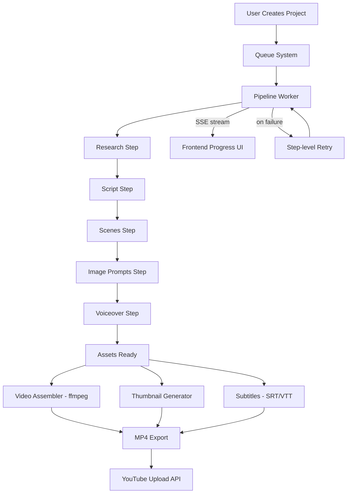

# AutoTube Factory — Improvement Plan

## Current State Summary
- Full pipeline works: research → script → scenes → image-prompts → voiceover ✅
- Free LLM fallback chain (Groq → Google AI → OpenRouter) works ✅
- Image generation via Pollinations (with gradient fallback) ✅
- TTS via gTTS / edge-tts (requires Python) ✅
- Thumbnail via Sharp + Pollinations (with gradient fallback) ✅

---

## Priority 1 — Reliability & Stability

### 1.1 Step-level retry + pipeline resume
**Problem:** The entire pipeline is one giant `try/catch` in `runPipeline()`. If step 4 (image-prompts) fails after steps 1-3 succeeded, the project is marked `failed` and user must restart from scratch.  
**Fix:** Track `completedSteps[]` in the DB. On retry, skip already-completed steps.  
**Files:** `app/api/projects/route.ts`, `prisma/schema.prisma`

### 1.2 Image generation 500 errors
**Problem:** `POST /api/images/generate` returns 500 frequently (Pollinations flaky). UI shows broken images.  
**Fix:** In `lib/image-router.ts`, add 2 auto-retries with 1s delay before moving to next source. Add `status: "failed"` to the imagePrompt record so UI shows a "retry" button instead of a blank slot.  
**Files:** `lib/image-router.ts`, `app/api/images/generate/route.ts`

### 1.3 Rate-limit backoff instead of instant skip
**Problem:** When Groq 429s, the fallback immediately jumps to Google. But Groq resets in 60s — if the user only has Groq key set, all models after it will also fail.  
**Fix:** Add a 3s wait + 1 retry before skipping a rate-limited model.  
**Files:** `lib/ai-fallback.ts`

### 1.4 JSON parse failures cause silent data loss
**Problem:** `extractJSON()` in `lib/llm-router.ts` can return partial/malformed data and the pipeline continues with empty fields.  
**Fix:** Add Zod schema validation per pipeline step. If validation fails, throw with a clear error message so the fallback chain tries the next model.  
**Files:** `lib/ai-fallback.ts`, `lib/llm-router.ts`

---

## Priority 2 — Features

### 2.1 Video assembly with ffmpeg
**Problem:** The app generates all assets (images, voiceover audio, subtitles) but never assembles them into an actual MP4 video.  
**Fix:** Add `/api/projects/[id]/assemble` route that uses `fluent-ffmpeg` to:
- Stitch images as a slideshow (each image = scene duration)
- Overlay voiceover audio
- Burn in subtitles from the `.srt` file
- Output to `public/generated/videos/`
**Files:** New `app/api/projects/[id]/assemble/route.ts`, `lib/video-assembler.ts`

### 2.2 Browser-based TTS fallback (Web Speech API)
**Problem:** TTS currently requires Python + gTTS/edge-tts installed. Many users won't have Python set up.  
**Fix:** Add a client-side TTS option in `VoiceoverTab.tsx` using the browser's built-in `window.speechSynthesis` API. Record audio via `MediaRecorder`. Zero install required.  
**Files:** `app/project/[id]/_components/VoiceoverTab.tsx`

### 2.3 YouTube upload integration
**Problem:** The app generates YouTube metadata (titles, description, tags) but has no upload capability.  
**Fix:** Add a YouTube OAuth flow + upload button in `ExportTab.tsx` using the YouTube Data API v3. Store OAuth tokens encrypted in the DB.  
**Files:** `app/api/youtube/`, `app/project/[id]/_components/ExportTab.tsx`

### 2.4 Bulk project creation / automation queue
**Problem:** There's a scheduler (`lib/scheduler.ts`) but no queue system. Creating 10 projects at once would run 10 pipelines in parallel, hammering rate limits.  
**Fix:** Add a simple FIFO queue backed by a new `Queue` Prisma model. Process 1 project at a time (configurable concurrency).  
**Files:** `lib/queue.ts`, `prisma/schema.prisma`

---

## Priority 3 — Performance & UX

### 3.1 Real-time pipeline progress via SSE
**Problem:** `GenerationProgress.tsx` polls `/api/projects/[id]/status` every 2s. This creates 50+ requests per pipeline run.  
**Fix:** Replace polling with Server-Sent Events (SSE). The pipeline pushes step updates to a `ReadableStream` that the client subscribes to.  
**Files:** `app/api/projects/[id]/stream/route.ts`, `app/project/[id]/_components/GenerationProgress.tsx`

### 3.2 LLM response caching
**Problem:** Re-running a pipeline for the same topic hits the API again unnecessarily.  
**Fix:** Cache LLM responses in SQLite (keyed by `hash(system+user)`). TTL: 24 hours. Show "from cache" badge in the UI.  
**Files:** `lib/llm-cache.ts`, `lib/ai-fallback.ts`, `prisma/schema.prisma`

### 3.3 Model performance telemetry
**Problem:** The fallback chain order in `FREE_MODEL_PRIORITY` is static. No tracking of which models actually succeed/fail for this user.  
**Fix:** Log each model attempt (success/fail/latency) to a `ModelLog` table. Show a live leaderboard in Settings → AI Providers.  
**Files:** `lib/ai-fallback.ts`, `prisma/schema.prisma`, `app/settings/page.tsx`

### 3.4 Better thumbnail generation
**Problem:** Pollinations fails ~40% of the time for thumbnails, always falling back to a plain gradient. Result looks amateur.  
**Fix:** Use Stability AI free tier (1000 free credits/month) or fal.ai as a more reliable AI image source. Also add a template-based thumbnail builder with color schemes, emoji, and icons — no external API needed.  
**Files:** `lib/thumbnail-generator.ts`, `lib/image-generators/`

### 3.5 Project dashboard improvements
**Problem:** The home page list shows minimal project info. No search, no filter by status, no bulk delete.  
**Fix:** Add status filter chips (all / generating / completed / failed), search by title, bulk select + delete. Show thumbnail preview in the list.  
**Files:** `app/page.tsx`, `app/projects/page.tsx`

---

## Architecture Diagram

---

## Recommended Implementation Order

1. ✅ **1.1** Pipeline resume — biggest reliability win, prevents wasted API calls
2. ✅ **1.2** Image retry logic — fixes visible 500 errors in UI  
3. ✅ **2.1** Video assembly — transforms the app from "asset generator" to "video creator"
4. ✅ **3.1** SSE progress — better UX, reduces server load
5. ✅ **2.2** Browser TTS — removes Python dependency for most users
6. ✅ **3.4** Better thumbnails — improves output quality
7. ✅ **1.4** Zod validation — hardens the pipeline
8. ✅ **3.2** LLM caching — saves API quota
9. ✅ **2.3** YouTube upload — completes the automation loop
10. ✅ **2.4** Job queue — needed for multi-project automation
